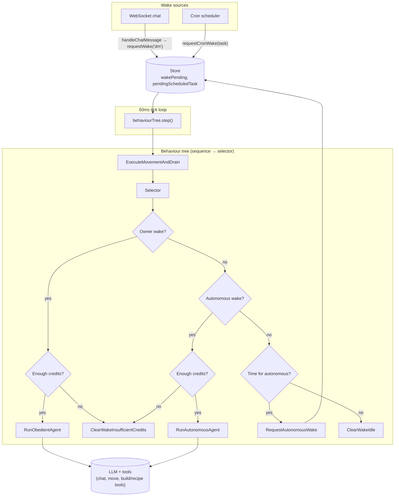

# DoppelClaw

**DoppelClaw** is a lightweight agent runtime that runs a single behaviour tree (Mistreevous) on a 50ms tick. Wakes—from chat (DM), cron, or an autonomous scheduler—decide whether the **Obedient** agent (user-driven) or **Autonomous** agent runs each tick. One loop, one tree, plug in your LLM and tools.

See [docs/PLAN-AGENT-WAKE-DRIVEN.md](docs/PLAN-AGENT-WAKE-DRIVEN.md) for the design.

## Usage

**Minimal (no hub):**
```ts
import { loadConfig, createClawStore, createRunner, handleChatMessage } from "@doppelfun/claw";

const config = loadConfig();
const store = createClawStore("0_0");
const loop = createRunner({ store, config, client: myClient });
loop.start();
myClient.onMessage("chat", (payload) => handleChatMessage(store, config, payload));
```

**With hub (profile + join block + credits):**
```ts
import {
  bootstrapAgent,
  createSession,
  createRunner,
  handleChatMessage,
  refreshBalance,
} from "@doppelfun/claw";

const { config } = await bootstrapAgent();  // fetches profile, applies voiceEnabled/soul/dailyCreditBudget
const session = await createSession(config, config.blockId!, { refreshBalance: true });
if (!session.ok) throw new Error(session.error);
const { store, jwt, engineUrl, blockSlotId } = session;

// Create @doppelfun/sdk client with engineUrl and jwt, connect, then:
const loop = createRunner({
  store,
  config,
  client: myClient,
  onUsageReportFailure: (msg) => console.warn(msg),
});
loop.start();
myClient.onMessage("chat", (payload) => handleChatMessage(store, config, payload));
```

When the agent sends TTS, call `reportVoiceUsageToHub(config, store, text.length)` so the hub can deduct voice credits. Without a `client`, the loop still ticks; Obedient and Autonomous are no-ops until you pass a client.

**CLI (run the agent from the command line):**
```bash
# Set DOPPEL_AGENT_API_KEY and optionally BLOCK_ID (or use profile default). Then:
pnpm build && pnpm start
# or: node dist/cli.js
# or link and run: doppel-claw
```
The CLI bootstraps, joins a block (from profile default or `BLOCK_ID`), connects the SDK client, wires chat → `handleChatMessage`, starts the runner and optional cron scheduler (if profile has `cronTasks`), then connects. Use `.env` for keys (dotenv loaded from cwd and package dir).

**Cron scheduler (optional):** If the hub profile includes `cronTasks` with `intervalMs`, use `startCronScheduler(store, getTasks, { checkIntervalMs })` so that when a task is due the scheduler calls `requestCronWake(store, task)`. The behaviour tree routes cron wakes to the Obedient agent.

## Recipes

The Obedient agent can generate procedural MML via **recipes** from [@doppelfun/recipes](https://github.com/doppelfun/doppel-sdk/tree/main/packages/recipes). Recipes are pure generators (no LLM): params in → MML out. Claw wires two tools:

- **`list_recipes`** — No args. Returns available recipe names (e.g. `city`, `pyramid`, `grass`, `trees`) so the agent can choose before calling `run_recipe`.
- **`run_recipe`** — `kind` (city / pyramid / grass / trees), optional `documentMode` (new / replace / append), `documentId`, and `params` per recipe (e.g. `rows`, `cols`, `blockSize` for city). Writes MML via the build document API (new document, or replace/append by id).

Recipes live in the recipes package; claw depends on `@doppelfun/recipes` and calls `listProceduralKinds()` and `runProceduralMml()` in the tool handlers. For custom scenes the agent uses `build_full` / `build_incremental` instead.

## Architecture



## Exports

- **Loop:** `createAgentLoop`, `createRunner`, `createTreeAgent`, `TREE_DEFINITION`
- **Wake:** `requestWake`, `WakeType`, `WakePayload`
- **Handlers:** `handleChatMessage`, `ChatPayload` (wire WS chat → store + requestWake)
- **State:** `createClawStore`, `createInitialState`, `ClawState`, `ClawStore`, etc.
- **Config:** `loadConfig`, `ClawConfig`
- **Prompts:** `buildSystemContent`, `buildUserMessage`
- **Agents:** `runObedientAgentTick`, `runAutonomousAgentTick`
- **Build:** `createRunBuildStubTool` (from lib/build; Obedient uses direct build/recipe tools from the tool registry)
- **Hub:** `getAgentProfile`, `reportUsage`, `checkBalance`, `applyHubProfileToConfig`, `HubAgentProfile`
- **Credits:** `reportUsageToHub`, `reportVoiceUsageToHub`, `hasEnoughCredits`, `refreshBalance`, `MIN_BALANCE_THRESHOLD`
- **Cron:** `requestCronWake(store, task)`, `startCronScheduler(store, getTasks, options)` — tree routes cron to Obedient
- **Bootstrap:** `bootstrapAgent()`, `createSession(config, blockId, { refreshBalance })`, `getDefaultBlockId(profile, config, fallback)`

## Build

```bash
pnpm run build
```

## Tests

```bash
pnpm test
```
