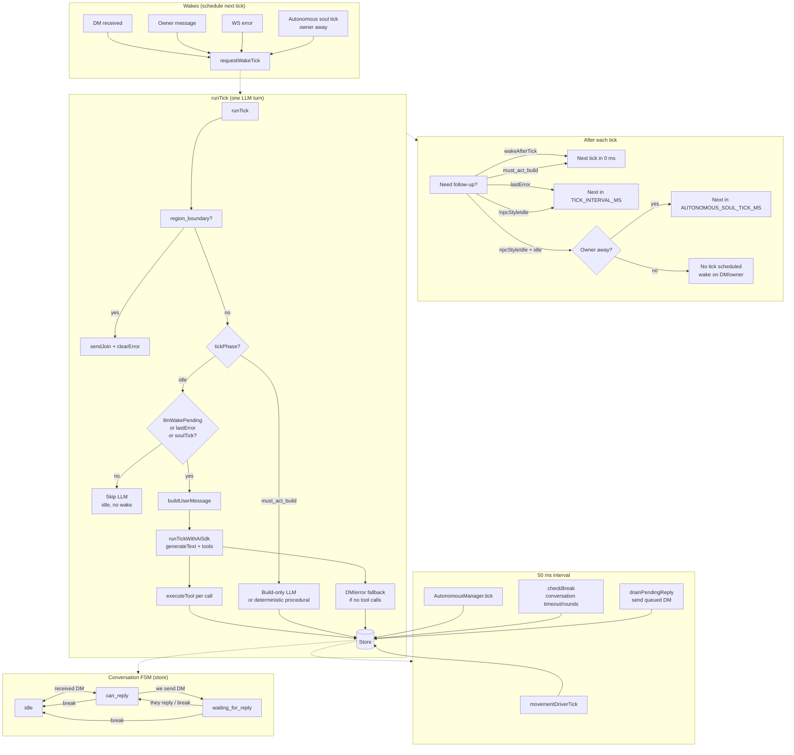

# DoppelClaw

LLM-driven agent runtime for Doppel. Connects to the hub and engine via [@doppelfun/sdk](https://www.npmjs.com/package/@doppelfun/sdk), runs a tick loop with a Chat LLM and tools (move, chat, emote, build, etc.), and supports owner-controlled chat.

**LLM stack**

- **Chat tick:** [Vercel AI SDK](https://sdk.vercel.ai/) `generateText` + tools — **OpenRouter** by default, or **Gemini** when `LLM_PROVIDER=google` ([`@ai-sdk/google`](https://ai-sdk.dev/providers/ai-sdk-providers/google-generative-ai)) or `LLM_PROVIDER=google-vertex` ([`@ai-sdk/google-vertex`](https://ai-sdk.dev/providers/ai-sdk-providers/google-vertex)). Model ids: [Gemini models](https://ai.google.dev/gemini-api/docs/models).
- **Build MML:** **`LlmProvider.complete`** — OpenRouter, or **`@google/genai`** for both `google` and `google-vertex`.
- **build_with_code:** Gemini-only — `generateContent` with **`tools: [{ codeExecution: {} }]`** so the model can run Python in Google’s sandbox, then emit MML; same persist path as `build_full` (`createDocument` / `updateDocument`). OpenRouter returns a clear error if invoked.
- **Wake intent** (`must_act_build`): same provider as build; OpenRouter uses `generateObject`, Google uses `generateContent` + JSON parse.
- Tool schemas: **`lib/tools/toolsZod.ts`**; execution: **`lib/tools/tools.ts`**.

**Layout:** `src/lib/state/` (types + `createInitialState` in `state.ts`, **Zustand store** in `store.ts` — one store per run via `createClawStore(blockSlotId)`), `src/lib/llm/`, `src/lib/agent/`, `src/lib/tools/`, `src/lib/conversation/`, `src/lib/movement/`, `src/util/` (blockBounds, dm, delay, env, math, position, url, uuid). Entry: `cli.ts`, `index.ts`. Tick/idle/tools flow is documented below.

Use this package when you want a full agent that thinks and acts in a Doppel block with minimal code.

## Tick, idle state, and tools (flow)

The agent runs a **tick loop** (one LLM turn + tool runs) and a **50 ms interval** (movement, conversation checks, autonomous behavior). When **idle** and `CLAW_NPC_STYLE=1` (default), no LLM runs until a **wake** (DM, owner message, or soul tick when owner away). The diagram below shows how ticks are scheduled, how `runTick` uses the store and tools, and how the 50 ms loop and conversation FSM interact.



- **Wakes:** DM, owner chat, or WS error sets `llmWakePending` (or similar) and calls `requestWakeTick`. That either runs `runTick` soon (debounced) or, if a tick is already running, sets `wakeAfterTick` so the next tick runs immediately after.
- **runTick:** If `region_boundary` error, auto-join that block. If `tickPhase === "must_act_build"`, run build-only tools (or deterministic `generate_procedural`); otherwise, if idle and no wake, skip the LLM. Else build the user message from store, call `runTickWithAiSdk` (Vercel AI SDK `generateText` with claw tools). Each tool call runs `executeTool`; tools read/update the store. If the model doesn’t call a tool and a DM or error reply is pending, a fallback message is sent.
- **After tick:** Next run is scheduled: 0 ms if follow-up or must_act_build; else if `npcStyleIdle` and no wake, either next soul tick (owner away) or no schedule (wake on DM/owner); else next in `TICK_INTERVAL_MS`.
- **50 ms loop:** `movementDriverTick` (approach target or stick input), `AutonomousManager.tick` (wander/seek/emote when owner away), `checkBreak` (conversation timeout or round limit → idle), `drainPendingReply` (send any queued DM). All read/update the same store.
- **Conversation FSM:** `idle` → `can_reply` when we receive a DM; `can_reply` → `waiting_for_reply` when we send a DM; breaks (timeout, owner message, join, etc.) and `end_conversation` tool reset to `idle`. Used to gate whether we may send a DM and to show “waiting for reply” state.

## Install

```bash
pnpm add @doppelfun/claw
```

**Dependencies:** `@doppelfun/sdk` (hub/engine). `@doppelfun/gen` (procedural MML / `generate_procedural`). `@google/genai` + `@ai-sdk/google` (+ optional `@ai-sdk/google-vertex`) for the Google path without OpenRouter.

## Quick start

### CLI

Set environment variables (see below), then:

```bash
npx @doppelfun/claw
# bin name: doppel-claw — same entry
# from repo: pnpm run start (packages/claw) after build

# tests (vitest)
pnpm run test
```

### Programmatic

```ts
import { runAgent, createLlmProvider, loadConfig } from "@doppelfun/claw";

await runAgent({
  onConnected: (blockSlotId, engineUrl) => console.log("Connected:", blockSlotId, engineUrl),
  onDisconnect: (err) => console.error("Disconnected:", err),
  onTick: (summary) => console.log("[tick]", summary),
  onToolCallResult: (name, args, result) => console.log(name, result),
  skillIds: ["doppel", "doppel-block-builder"],
});

// Advanced: obtain the same provider Claw uses for build/intent
const config = loadConfig();
const provider = createLlmProvider(config);
```

Configuration is read from environment variables (and optionally overridden by the hub profile). Copy `.env.example` to `.env` in the repo root or in your app.

## Environment variables

| Variable | Required | Default | Description |
|----------|----------|---------|-------------|
| DOPPEL_AGENT_API_KEY | Yes | — | API key for the hub. |
| OPENROUTER_API_KEY | When openrouter | — | Required when `LLM_PROVIDER=openrouter`. Omit when using `google` / `google-vertex` (default). |
| LLM_PROVIDER | No | **google** | `google` (default) — `GOOGLE_API_KEY`. `google-vertex` — project + location, ADC. `openrouter` — all OpenRouter. |
| GOOGLE_API_KEY | When google | — | Required when `LLM_PROVIDER=google` (default). |
| GOOGLE_CLOUD_PROJECT | When google-vertex | — | GCP project id. |
| GOOGLE_CLOUD_LOCATION | When google-vertex | — | e.g. `us-central1`. |
| BLOCK_ID | No | — | **Optional local override.** Block to join comes from the agent profile (`GET /api/agents/me` → `defaultBlock.blockId`, i.e. hub `default_space_id`). Set `BLOCK_ID` only when the profile has no default space or you need to force a different block locally. |
| HUB_URL | No | http://localhost:4000 | Hub base URL. |
| ENGINE_URL | No | http://localhost:2567 | Engine base URL. |
| OWNER_USER_ID | No | — | Doppel user id; their in-world chat is treated as owner commands. |
| CHAT_LLM_MODEL | No | openrouter/auto / gemini-2.5-flash | OpenRouter id when openrouter; Gemini id when google or google-vertex (default `gemini-2.5-flash`). |
| BUILD_LLM_MODEL | No | openrouter/auto / gemini-2.5-flash | Same. |
| TICK_INTERVAL_MS | No | 5000 | Ms between ticks when idle (min 2000). |
| WAKE_TICK_DEBOUNCE_MS | No | 150 | Debounce before running a tick after DM or owner chat (0–2000). |
| MAX_CHAT_CONTEXT | No | 20 | Max recent chat lines in context. |
| MAX_OWNER_MESSAGES | No | 10 | Max owner messages in context. |
| AGENT_API_URL | No | HUB_URL | Base URL for agent API (claw-config, PATCH me). |
| SKILL_IDS | No | doppel,doppel-block-builder | Comma-separated skill IDs for claw-config. |
| TOKENS_PER_CREDIT | No | 1000 | Hub ledger: tokens per credit for usage reporting. |
| BUILD_CREDIT_MULTIPLIER | No | 1.5 | Scales reported build usage (completion tokens) for hub charge. |
| ALLOW_BUILD_WITHOUT_CREDITS | No | — | `1` / `true` skips balance pre-check and report-usage (no ledger deduction; local dev only). |
| CLAW_VERBOSE | No | — | `1` / `true` enables `[claw:debug]` lines (tool arg payloads, chat previews, next-tick delay). |
| CLAW_NPC_STYLE | No | `1` (on) | When on (default): no idle LLM polling — like NpcDriver, only 50ms movement until DM/owner. `0` / `false` = schedule `runTick` every `TICK_INTERVAL_MS` even when idle. |
| OWNER_NEARBY_RADIUS_M | No | 14 | Meters within which the owner counts as “nearby”—obedient mode only (Owner said / DMs). |
| AUTONOMOUS_SOUL_TICK_MS | No | 45000 | When owner away, LLM runs this often so **autonomous actions follow the SOUL**. `0` = no autonomous ticks between wakes (movement only via explicit `movementTarget` from last LLM). |
| SESSION_REFRESH_INTERVAL_MS | No | 1200000 (20m) | Periodically **POST joinBlock** to refresh hub JWT, **POST /api/session** to refresh HTTP session, and **reconnect WS** so the agent stays connected without pm2 restart. `0` disables. |

## LLM providers (detail)

| Provider | Chat tick | Build MML | Wake intent |
|----------|-----------|-----------|-------------|
| **openrouter** (default) | OpenRouter | OpenRouter | OpenRouter `generateObject` |
| **google** (default) | `@ai-sdk/google` | `@google/genai` | JSON parse |
| **google-vertex** | `@ai-sdk/google-vertex` | `@google/genai` (Vertex) | JSON parse |

**Adding a provider:** Implement `LlmProvider` in `src/lib/llm/providers/`, register in `createLlmProvider()` in `src/lib/llm/provider.ts`, add config fields and env parsing in `config.ts`.

## Behavior

- **Owner nearby vs away:** With `OWNER_USER_ID` set, **inside `OWNER_NEARBY_RADIUS_M`** → **obedient mode** (only Owner said / DMs). **Outside** → **autonomous mode** driven by the **SOUL**: periodic `AUTONOMOUS_SOUL_TICK_MS` (default 45s). Set `AUTONOMOUS_SOUL_TICK_MS=0` to disable autonomous ticks until the next wake.
- **Same cadence as block NPCs (NpcDriver):** Engine NPCs use a **50ms** input loop only (`NPC_INPUT_INTERVAL_MS`); LLM runs **only when a player DMs that NPC** (server-side `npcChatCompletion` + cooldowns). Claw matches that: **50ms `movementDriverTick`** when approaching a target; **no periodic LLM** when idle (`CLAW_NPC_STYLE` default on)—LLM runs on DM/owner wake, `must_act_build` follow-up, or `lastError` retry. Set `CLAW_NPC_STYLE=0` to restore polling every `TICK_INTERVAL_MS`.
- **Wake-only LLM (credit saver):** Idle ticks **do not** call the LLM. One turn per wake unless build phase needs consecutive ticks.
- **Realtime wake:** DM or owner message debounces then runs a tick; burst messages coalesce.
- **must_act_build:** After wake, intent is classified via the active provider. If `requiresBuildAction`, chat is disabled until a build tool runs or phase times out (~4 ticks). Procedural city/pyramid can run without chat LLM; otherwise build-only tool set.
- **Chat:** Replies only in DM threads and owner instructions. Chat tool withheld after reply until new input.
- **Movement:** ±0.4 clamp; **auto-walk** via `approachSessionId` / `approachPosition` + 50ms driver (NPC-style).
- **Tools:** move, chat, emote, join_block, get_occupants, get_chat_history, list_catalog, build_full, build_with_code, build_incremental, list_documents, get_document_content, delete_document, delete_all_documents, generate_procedural.

## API

- **`runAgent(options?)`** — Starts the agent (creates one Zustand store per run internally).
- **`AgentRunner`** — Class wrapper around `runAgent`.
- **`loadConfig()`** — Load `ClawConfig` from env.
- **`createLlmProvider(config)`** — Returns `LlmProvider` (OpenRouter or Google) for build/intent.
- **`createClawStore(blockSlotId)`** — Create the Zustand store for one agent run; used internally by `runAgent`.
- **`HubClient`**, **`joinBlock`**, **`createBlock`** — Hub helpers.
- **`createInitialState`**, **`executeTool`** — State shape and low-level tool execution.

## Requirements

Node ≥ 20. ESM only.
